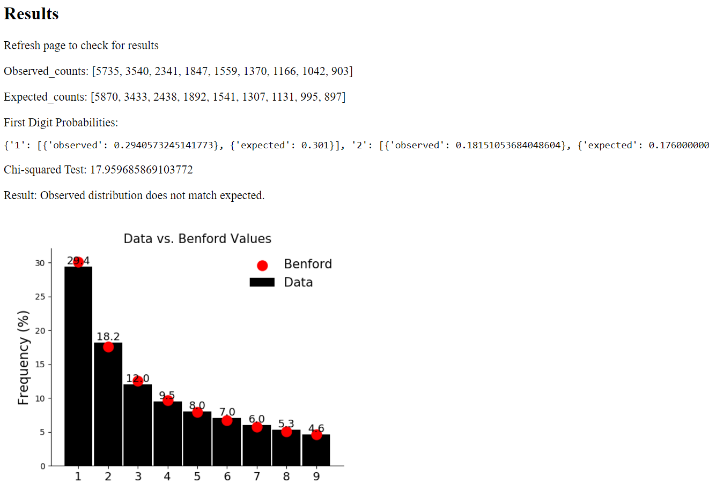

# Benford

 ## Main

* User input validation
* The preferred form of asynchronous execution - a separate worker that could potentially work on another machine 
and some kind of communication system between them (e.g. through RabbitMQ or Redis).
* The solution should include automatic tests.
* Tests should be written in some test framework, e.g. built-in unittest or pytest, and should be run independently.
* Starting the microservice should be maximally automated (Docker).

## Goal

* Goal is to create a python-based web application, that can ingest flat file with a viable target column, and do some
computations over it.
* Because files can be any length, the computations can also be very long.
* Because of such reason we need some sort of asynchronous execution of our code, so that our users would be allowed to 
see what's happening with their order (stopped?, running?, done?).
* I'm using Redis (message broker) to meet this requirement. Flask application will be sending him a basic task 
information. Job (computations) will be executed by separate worker(s). Each worker will process a single job
at a time. Within a worker, there is no concurrent processing going on, so if we want to perform more jobs concurrently,
we simply have to start more workers (easier scalability).

## Running
Check docker-compose.yml:

### Run Docker
* $ docker-compose up
* Open your browser to http://localhost:5000 to view the app or 
* Open to http://localhost:9181 to view the RQ dashboard.

Build/Rebuild the image
* $ docker-compose up --build

### Run Windows (manually without docker):
* Run app: webapp/app/app.py
* Run worker: webapp/app/worker.py
* Run Redis Server: _Redis-x64-3.2.100/redis-server.exe
* Run MongoDB server.exe
* Open your browser to http://localhost:5000 to view the app

## References
* [Python 3.7.4](https://www.python.org/)
* [Redis](https://redis.io/)
* [RQ (Redis Queue): Simple Redis job queues management for Python](https://python-rq.org/)
* [MongoDB](https://www.mongodb.com/)
* [PyMongo: MongoDB Connector](https://pymongo.readthedocs.io/en/stable/)
* [rq_dashboard: Dashboard for RQ Stats](https://github.com/Parallels/rq-dashboard)
* [flask_testing: Easy testing for flask](https://pythonhosted.org/Flask-Testing/)

## Log
* v1.00 Release 26-04-2020